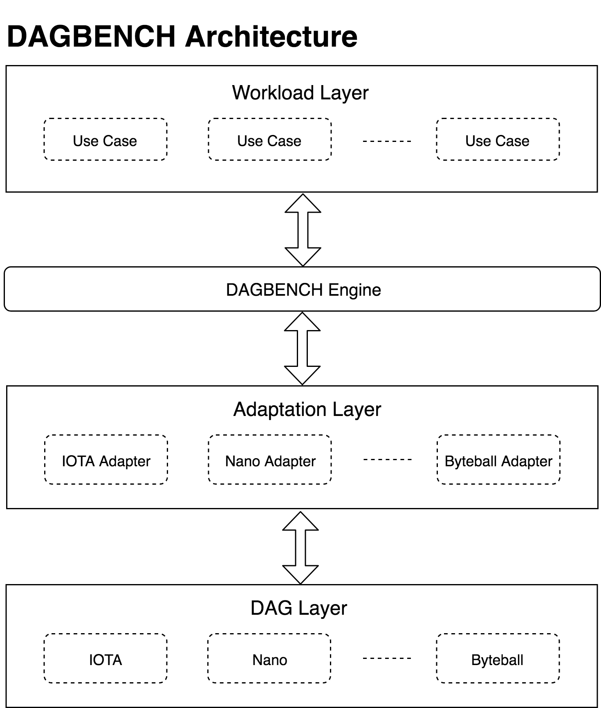
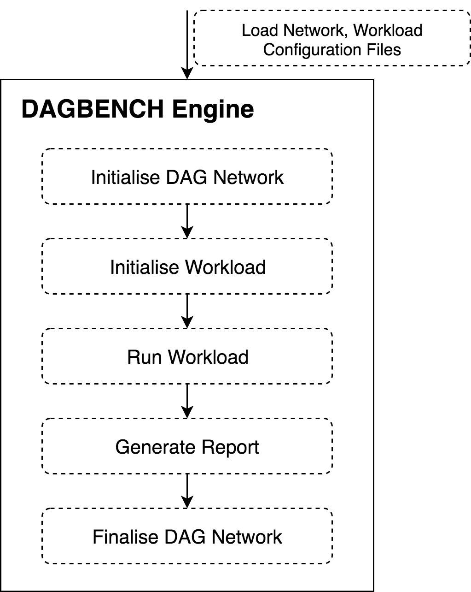

# DAGBENCH

DAG performance evaluation tool

Currently supported DAG blockchains:

* IOTA
* Nano
* Byteball

Currently supported workloads:

* Valuetransfer
* Query

We conducted an evaluation of the three DAG solutions with the DAGBENCH, we identified some observations in a report: https://www.overleaf.com/3277718854tfscgkrpfjtv

## How to start a performance test
```
node engine.js --net iota --work valuetransfer --env local
```
* `net`: type of DAG network
* `work`: type of workload
* `env`: type of environment, default is `local`. To implement other env platform, please rewrite `dag.init()` in different network's adaptors.

The `engine.js` will read the configuration file of [net]-[work].json under `network` folder and run the test accordingly.

Some prerequsites for running a DAG network should be installed and configured before running the test. Please read the installation instruction under each `network` repositories and install the prerequsites accordingly.

## How to add a new DAG network
1. Create a folder under `adaptor`, then create a class [newNet] extending `DAGInterface`.
2. Create a folder under `network`, then create a configuration json file for each workload, such as: [newNet-valuetransfer.json].

## How to add a new workload

1. Create a folder under `workload`, then create a class [newWork] extending `workloadInterface`.
2. Create configuration files (json) for each DAG network under `network`.

## Architecture



Figure above illustrates the current DAGBENCH's implementation. To make all the workloads and DAG networks extensible, DAGBENCH is designed with a DAGBENCH engine, a DAG layer, an adaptation layer and a workload layer.

* DAGBENCH Engine: DAGBENCH engine will read a configuration file and load the corresponding workloads and adaptors.
* Workload Layer: Workloads are defined in this layer. The workload class will extend a `workload-interface` and will be called by the DAGBENCH Engine.
* Adaptation Layer: A `DAG-interface` is defined in adaptation layer, any DAG adaptor can implement this interface with its corresponding SDK or RESTful API.
* DAG Layer: DAG network is established in DAG layer. The configuration files for different workloads should be defined in this layer.

### DAGBENCH engine


The DAGBENCH engine is an entrance for the evaluation tool. The engine will accept three arguments: `net`, `work` and `env`. These arguments will indicate the network, workload and environment for this test. Then a `DAG` instance will be initialised and a `workload` instance will create the test.

### Workload layer

Workloads are defined in this layer. The workload class will extend a `workload-interface` and will be called by the DAGBENCH Engine.

Currently, two workloads are suppoted:

1. Value transfer: 

   This workload is a simple application that transfer coins or message from one user to another user. To better collect the test result, we imitate that all sender accounts transfer coins to one receiver account so that we can easily get the test result such as account balance.

2. Data query: 

   This workload considers the performance of a DAG network in answering queries about the historical data. We implement two queries:

   * Q1: Compute the number of input transactions and the number of output transactions for a given account.

   * Q2: Compute the number of balance for a given account.

   This workload needs to preload the historical data and then calculate the latency for the above query.

### Adaptation layer
A `DAG-interface` is defined in adaptation layer. Each DAG class needs to implement the defined functions with its corresponding SDK or RESTful API.

IOTA, Nano and Byteball are supppoted now.

### DAG layer

In this layer, DAG network is set and configuration files are defined. The detailed instruction on environment setup for IOTA, Nano and Byteball are listed below:

* IOTA setup: https://gitlab.com/tbsx3_sydney/dagbench/tree/master/network/iota
* Byteball setup: https://gitlab.com/tbsx3_sydney/dagbench/tree/master/network/byteball
* Nano setup: https://gitlab.com/tbsx3_sydney/dagbench/tree/master/network/nano